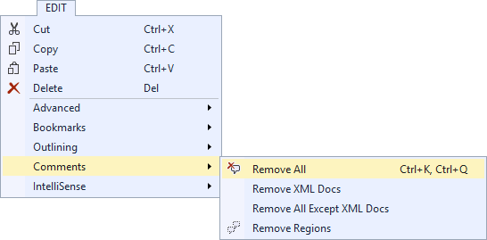

# Comment Remover

[](https://ci.appveyor.com/project/madskristensen/commentremover)

Download this extension from the [VS Gallery](https://visualstudiogallery.msdn.microsoft.com/845a87b1-3bd7-43a4-871d-0458d9fce206)
or get the [CI build](http://vsixgallery.com/extension/d7c3f904-cc5a-4d47-aa25-81fb7c36df89/).

---------------------------------------

Remove all comments in any file with a click of a button.
Powerful and precise.

See the [changelog](CHANGELOG.md) for changes and roadmap.

## Remove comments
Open any file and select the _Remove Comments_ button
in the top level menu or hit **Ctrl+K, Ctrl+Q**.



## Examples
Here are some examples of before and after the comments have
been removed

### JSON
Before:
```json
{
	// Single-line comment
	"foo": {
		/*
		multi
        line
        comment
		*/
		"prop": 12
	}
}
```

After:
```json
{
	"foo": {
		"prop": 12
	}
}
```

### CSharp
Before:
```c#
/// <summary>
/// Foo bar
/// </summary>
public class Class1
{
    /*
    multi
    line
    comment
    */
    void Hat()
    {
        //single-line comment 
        for (int i = 0; i < 10; i++)
        {
            System.Diagnostics.Debug.Write(i); // same-line comment
        }
    }
}
```

After:
```c#
public class Class1
{
    void Hat()
    {
        for (int i = 0; i < 10; i++)
        {
            System.Diagnostics.Debug.Write(i);   
        }
    }
}   
```

## Contribute
Check out the [contribution guidelines](.github/CONTRIBUTING.md)
if you want to contribute to this project.

For cloning and building this project yourself, make sure
to install the
[Extensibility Tools 2015](https://visualstudiogallery.msdn.microsoft.com/ab39a092-1343-46e2-b0f1-6a3f91155aa6)
extension for Visual Studio which enables some features
used by this project.

## License
[Apache 2.0](LICENSE)